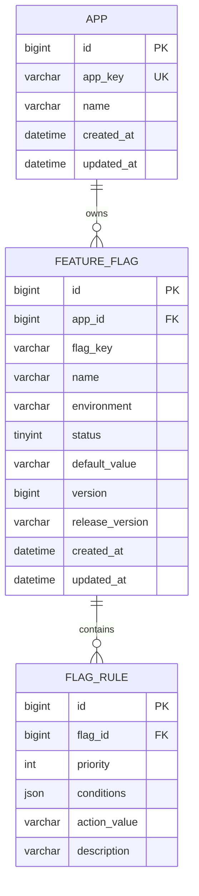

# Data Model Design

## 📋 Overview

The data model is designed to support high-throughput flag evaluations while maintaining flexibility for complex rule definitions. It follows a relational structure with optimized indexing for multi-tenant (App-based) isolation.

---

## 🗄️ Entity Relationship Diagram (ERD)

---

## 📑 Table Definitions

### 1. `app` (Application Registry)
Stores metadata for client applications consuming feature flags.

| Column | Type | Constraints | Description |
| :--- | :--- | :--- | :--- |
| `id` | BIGINT | PK, AUTO_INCREMENT | Internal identifier |
| `app_key` | VARCHAR(64) | UNIQUE, NOT NULL | Unique key used by SDKs for authentication/identification |
| `name` | VARCHAR(128) | NOT NULL | Human-readable application name |
| `created_at` | DATETIME | DEFAULT CURRENT_TIMESTAMP | Record creation time |
| `updated_at` | DATETIME | ON UPDATE CURRENT_TIMESTAMP | Last modification time |

**Design Rationale**:
- **`app_key` as Identifier**: Decouples internal IDs from external API usage, allowing easier migration or refactoring.
- **Multi-tenancy**: All subsequent tables are linked via `app_id`, ensuring strict data isolation between different services.

### 2. `feature_flag` (Flag Definitions)
The core table storing flag configurations per environment.

| Column | Type | Constraints | Description |
| :--- | :--- | :--- | :--- |
| `id` | BIGINT | PK, AUTO_INCREMENT | Internal identifier |
| `app_id` | BIGINT | FK, NOT NULL | Reference to `app.id` |
| `flag_key` | VARCHAR(128) | NOT NULL | The key used in code (e.g., `enable_new_checkout`) |
| `name` | VARCHAR(128) | NOT NULL | Display name for the admin dashboard |
| `environment` | VARCHAR(32) | NOT NULL, DEFAULT 'prod' | Target environment (prod, staging, dev) |
| `status` | TINYINT | DEFAULT 1 | 1: Active, 0: Inactive |
| `default_value` | VARCHAR(255) | DEFAULT 'false' | Fallback value when no rules match |
| `version` | BIGINT | DEFAULT 0 | Optimistic locking / Cache synchronization version |
| `release_version` | VARCHAR(64) | NULLABLE | Optional tag linking flag to a specific software release |
| `created_at` | DATETIME | DEFAULT CURRENT_TIMESTAMP | Record creation time |
| `updated_at` | DATETIME | ON UPDATE CURRENT_TIMESTAMP | Last modification time |

**Key Indexes**:
- `uk_app_env_key (app_id, environment, flag_key)`: Ensures uniqueness of a flag within an app's environment. Critical for fast lookups during evaluation.
- `idx_environment`: Supports filtering flags by environment in the admin UI.

### 3. `flag_rule` (Evaluation Rules)
Stores the logic that determines a flag's value based on user context.

| Column | Type | Constraints | Description |
| :--- | :--- | :--- | :--- |
| `id` | BIGINT | PK, AUTO_INCREMENT | Internal identifier |
| `flag_id` | BIGINT | FK, NOT NULL | Reference to `feature_flag.id` |
| `priority` | INT | NOT NULL | Execution order (lower number = higher priority) |
| `conditions` | JSON | NOT NULL | Array of condition objects (e.g., `[{"attribute": "region", "op": "==", "value": "US"}]`) |
| `action_value` | VARCHAR(255) | NOT NULL | The value returned if conditions are met |
| `description` | VARCHAR(512) | DEFAULT '' | Human-readable explanation of the rule |

**Key Indexes**:
- `idx_flag_priority (flag_id, priority)`: Ensures rules are fetched and evaluated in the correct order efficiently.

---

## 🚀 Design Principles

### 1. Environment Isolation
Instead of having separate databases for each environment, we use an `environment` column. This simplifies deployment and allows for easy cross-environment comparisons in the admin tool.

### 2. Version-Based Synchronization
The `version` field in `feature_flag` is incremented on every update. 
- **Server-side**: Used for incremental cache invalidation.
- **Client-side**: SDKs send their `lastKnownVersion` to determine if they need to pull new configurations.

### 3. Flexible Rule Storage (JSON)
Using a `JSON` type for `conditions` allows us to support complex logic (AND/OR nesting, various operators) without creating dozens of join tables. This aligns with the "High Throughput" requirement by keeping the read path simple.

### 4. Audit & Traceability
- `release_version`: Helps track which flags were introduced or modified in a specific product release.
- `created_at` / `updated_at`: Provides basic temporal tracking for debugging.

---

## 🔄 Evolution Plan

| Future Requirement | Proposed Change |
| :--- | :--- |
| **Audit Logging** | Add `audit_log` table or offload to Kafka/ELK as per architecture design. |
| **Flag Dependencies** | Add `dependency_flag_id` to `feature_flag` to prevent circular logic. |
| **A/B Testing Metrics** | Add `experiment_id` to link flags with external analytics platforms. |

---

*This schema is implemented in `ff-server/src/main/resources/schema.sql`.*
